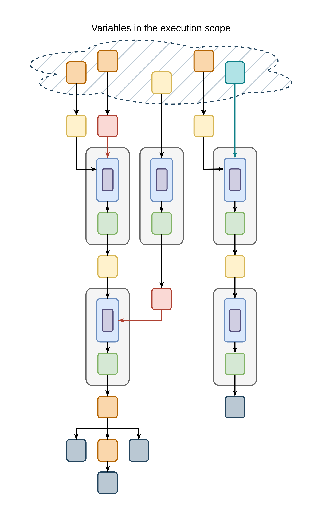

# Borrow Checking

This section describes how imem manages borrowing and the references that result from it.

## Borrow Checking Goals

### Dereferencing Definition

Dereferencing a box or reference is the implementation counterpart of computing \( \sigma(l) \), where \( l \) is the location to which the box or reference points.
This means that given a box \( b: \text{Box}[T, \ldots] \) whose resource is \( t: T \), dereferencing the box, \( deref(b) \), yields \( t \).
That is, \( deref(b) = t \).
And given a reference $r: \text{Mut}[T, \ldots]$ or $r: \text{Immut}[T, \ldots]$ whose resource is $t: T$, dereferencing the reference, $deref(r)$ would result in $t$.
That is, $deref(r) = t$.

### Goals

imem performs borrow checking to ensure that the following well-formedness [properties](./memory-management.md#properties_1) are satisfied:

- ***Borrowing Validity:***
  The implementation implication of this property is that during execution, for every immutable or mutable reference \(r \in \{\text{ImmutRef}[T, O'], \text{MutRef}[T, O']\}\), there is a box \(b : \text{Box}[T, O]\) that \(r\) is borrowed from, meaning \(deref(b) = deref(r)\) and \(O \subset O'\).

- ***Box reaching Reference:***
  In implementation, this property ensures that if a box \(b: \text{Box}[T, O]\) resource reaches a reference \(r \in \{\text{ImmutRef}[T', O'], \text{MutRef}[T', O']\}\) resource, in other words \(deref(b)\) reaches \(deref(r)\), then accessing \(b\) by an available variable causes \(r\) to become unavailable.

- ***Mutable Reference reaching Immutable Reference:***
  The implementation translation of this property means that if a mutable reference \(mr: \text{MutRef}[T, O]\) resource reaches an immutable reference \(ir \in \text{ImmutRef}[T', O']\) resource, in other words \(deref(mr)\) reaches \(deref(ir)\), then accessing \(mr\) by an available variable causes \(ir\) to become unavailable.

- ***Mutable Reference reaching Mutable Reference:***
  Similar to its formal definition, in implementation, this property implies that if a mutable reference \(m_1: \text{MutRef}[T, O]\) resource reaches a mutable reference \(m_2: \text{MutRef}[T', O']\) resource, in other words \(deref(m_1)\) reaches \(deref(m_2)\), then:

  - If \(deref(m_1) \neq deref(m_2)\):
    Accessing \(m_1\) by an available variable causes \(m_2\) to become unavailable.
  - If \(deref(m1) = deref(m2)\):
    Either accessing \(m_1\) by an available variable causes \(m_2\) to become unavailable, or accessing \(m_2\) by an available variable causes \(m_1\) to become unavailable.

The following two properties are not included in the list of memory well-formedness properties described in the memory management section.
However, the imem implementation needs to ensure them due to the addition of moving in the implementation:

- ***Mutable reference structurally constant view:***
  If a mutable reference \( mr: \text{MutRef}[T, O] \) is available, the structure of the subtree rooted at \( deref(mr) \) remains unchanged for as long as \( mr \) is available.
  This means that, for any box \( b: \text{Box}[T', O'] \) whose resource lies in that subtree, meaning \( deref(mr) \) reaches \( deref(b) \), the program does not perform `derefForMoving` or `moveBox` on \( b \) while \( mr \) is available.

- ***Immutable reference constant view:***
  This property ensures the ***Immutable Reference not reaching Mutable Reference*** well-formedness property and extends it to account for moving.
  The property implies that if an immutable reference \(ir : \text{ImmutRef}[T, O]\) is available, then the entire subtree of \(deref(ir)\) remains read-only.
  This means that:

  - There is no available mutable reference \(mr : \text{MutRef}[T', O']\) whose resource is in that subtree, meaning \(deref(ir)\) reaches \(deref(mr)\).
  - For any box \(b : \text{Box}[T', O']\) whose resource is in that subtree, \(deref(ir)\) reaches \(deref(b)\), the program does not perform `setBox`, `swapBox`, `derefForMoving` or `moveBox` on \(b\) as long as \(ir\) is available.

imem ensures *Borrowing Validity* through [Reference Ownership Management](#reference-ownership-management).
It enforces reaching properties through [Box and Reference Holding](#box-and-reference-holding) and [Reference Owner Aggregation](#reference-owner-aggregation).
It also guarantees the *Mutable reference structurally constant view* and the *Immutable reference constant view* through [Static Permission Management](#static-permission-management-of-operations).

## Reference Ownership Management

References, similar to boxes, are owned by a set of lifetime capabilities.

```Scala
class ImmutRef[T, Owner^](
  private[imem] val tag: InternalRef[T]#Tag,
  private[imem] val internalRef: InternalRef[T]
)

class MutRef[T, Owner^](
  private[imem] val tag: InternalRef[T]#Tag,
  private[imem] val internalRef: InternalRef[T]
) extends scinear.Linear
```

Both the `ImmutRef` and `MutRef` classes include an `Owner^` capture-set type parameter, which the program instantiates with a set of lifetimes.

imem does not provide interfaces for creating references out of thin air; instead, references are borrowed from boxes or from other references.

### Borrowing a Box

To borrow a box, imem provides the following interfaces:

```Scala
def borrowImmutBox[@scinear.HideLinearity T, Owner^, ..., newOwner^ >: {..., Owner}, ...](
  self: Box[T, Owner]^
)(...): (ImmutRef[T, newOwner], ...) = ...

def borrowMutBox[@scinear.HideLinearity T, Owner^, ..., newOwner^ >: {..., Owner}, ...](
  self: Box[T, Owner]^
)(...): (MutRef[T, newOwner], ...) = ...
```

`borrowImmutBox` and `borrowMutBox` borrow a box immutably and mutably, respectively.
Both operations take a `newOwner` type parameter and return a reference whose owner is `newOwner`.
Note that the resulting reference does not capture `self`. Therefore, escape-checking `self` has no effect on the returned reference.

For both functions, the owner type parameter `newOwner` of the returned reference must be a superset of the `Owner` type parameter.
As a result, the reference's owners include all the lifetime capabilities owners of the box from which the reference is borrowed.
By enforcing the constraint `newOwner^ >: {..., Owner}`, imem ensures *Borrowing validity* when borrowing a box.

### Borrowing an Immutable Reference

At any point, multiple immutable references may simultaneously share a resource.
To enable this, the program first borrows a box immutably and then reborrows the resulting immutable reference as many times as needed.
The following is imem's interface for reborrowing an immutable reference:

```Scala
def borrowImmut[@scinear.HideLinearity T, Owner^, ..., newOwner^ >: {..., Owner}, ...](
  self: ImmutRef[T, Owner]^
)(...): ImmutRef[T, newOwner] = ...
```

`borrowImmut` for an immutable reference is similar to `borrowImmutBox`.
The returned reference does not capture `self`.
Therefore, even if `self` is escape-checked, the program can copy the returned reference and store it freely.
In addition, the `newOwner` type parameter, with the constraint `newOwner^ >: {..., Owner}`, ensures that reborrowed immutable references live no longer than the original immutable reference, in line with *Borrowing validity* goal.

### Borrowing a Mutable Reference

imem allows the program to reborrow a mutable reference either mutably or immutably.

#### Mutably borrowing a mutable reference
`borrowMut` mutably borrows a mutable reference and produces another mutable reference.

```Scala
def borrowMut[@scinear.HideLinearity T, Owner^, ..., newOwnerKey, newOwner^ >: {..., Owner}, ...](
  self: MutRef[T, Owner]^
)(...): (MutRef[T, newOwner], ...) = ...
```

The signature is identical to that of `borrowMutBox`, and ownership monotonicity is preserved.
This means that the owner of the derived reference, `newOwner`, is a superset of the owner of the original reference, `Owner`.
As a result, the original reference, and transitively the box, outlives the derived reference.

### Immutably borrowing a mutable reference

To immutably borrow a mutable reference, imem provides `borrowImmut`:

```Scala
def borrowImmut[@scinear.HideLinearity T, Owner^, ..., newOwner^ >: {..., Owner}, ...](
  self: MutRef[T, Owner]^
)(...): (ImmutRef[T, newOwner], ...)
```

The same as `borrowMut`, except that `borrowImmut` returns an immutable reference.

## Box and Reference Holding

### Value Holder

To ensure that `MutRef` and `Box`, or `ImmutRefs`, do not coexist for the same resource at the same time and to follow the [Stacked Borrows Model](../background/stacked-borrows.md), imem uses a mechanism that ties the existence of one entity to the non-existence of another.
In the [memory management section](../imem/memory-management.md#memory-with-imem-references-and-lifetimes), \(\text{hold}\) references are responsible for tying reference accesses to the expiration of other references.
In the implementation, a combination of `ValueHolder` and `Lifetime` enables this mechanism.

```Scala
class ValueHolder[KeyType, T](private[imem] val value: T) extends scinear.Linear
```

`ValueHolder` is a simple linear class parameterized by `KeyType` and containing a field of type `T` that stores a value of any type.
The value can only be accessed through the following function:

```Scala
def unlockHolder[KeyType, @scinear.HideLinearity T](
  key: KeyType,
  holder: ValueHolder[KeyType, T]^
): T^{holder} = holder.value
```

The `unlockHolder` function returns the value only when a key instance that matches the `KeyType` type parameter of the holder is provided.
To make the function usable by other imem interfaces, the holder captures the universal capability, and the returned value captures the holder in case the holder is subject to [escape checking](../background/capturing-types.md#escape-checking).

Imem ties a `ValueHolder` to a `Lifetime` by using an internal opaque dependent type as the key.
In this way, unlocking the holder always causes the associated lifetime to expire.

```Scala
class Lifetime[OwnersInput^] extends scinear.Linear, caps.Capability:
  type Owners^ = {OwnersInput, this}
  opaque type Key = Object

  def getKey[O^](): Key = Object()
end Lifetime
```

In the Lifetime class, `Key` is an opaque type member.
The only way to obtain an instance of this type is through the `getKey` method of `Lifetime` because the type is opaque outside the class.
At the same time, because `Key` is a type member, each instance of type `Lifetime` has its own [path-dependent](../background/dependent-types.md) `Key` type that is unique to that instance.

As shown below, a `ValueHolder[lf1.Key, ...]` can only be opened by `lf1` and by no other lifetime.

```Scala
val lf1 = Lifetime[{}]()
val lf2 = Lifetime[{}]()

val holder = ValueHolder[lf1.Key, String]("My Secured Resource") // locked with `lf1`'s key

val illegalAccess = unlockHolder(lf2.getKey(), holder)
//                                             ^^^^^^
// Found:    (holder : imem.ValueHolder[lf1.Key, String])
// Required: imem.ValueHolder[KeyType, T]^
// where:    KeyType is a type variable with constraint >: lf2.Key
//           T       is a type variable

val okAccess = unlockHolder(lf1.getKey(), holder) // ok
```

### Borrowing and Holder Results

The `Box` and `MutRef` references are linear types.
This means that when the program borrows them, using the borrowing interfaces, the instance passed to the interfaces expires.
But the program might need the passed references and imem provides the expired instances in `ValueHolder` tied to the `Lifetime` capability that the newly borrowed reference is associated with.

The following list presents all borrowing functions provided by imem:

```Scala
def borrowImmutBox[@scinear.HideLinearity T, Owner^, ..., newOwnerKey, newOwner^ >: {..., Owner}, ...](
  self: Box[T, Owner]^
)(...): (ImmutRef[T, newOwner], ValueHolder[newOwnerKey, Box[T, Owner]^{self}]) = ...

def borrowMutBox[@scinear.HideLinearity T, Owner^, ..., newOwnerKey, newOwner^ >: {..., Owner}, ...](
  self: Box[T, Owner]^
)(...): (MutRef[T, newOwner], ValueHolder[newOwnerKey, Box[T, Owner]^{self}]) = ...

def borrowMut[@scinear.HideLinearity T, Owner^, ..., newOwnerKey, newOwner^ >: {.., Owner}, ...](
  self: MutRef[T, Owner]^
)(...): (MutRef[T, newOwner], ValueHolder[newOwnerKey, MutRef[T, Owner]^{self}]) = ...

def borrowImmut[@scinear.HideLinearity T, Owner^, ..., newOwnerKey, newOwner^ >: {..., Owner}, ...](
  self: MutRef[T, Owner]^
)(...): (ImmutRef[T, newOwner], ValueHolder[newOwnerKey, MutRef[T, Owner]^{self}])
```

All borrowing functions return a pair.
The first element of the pair is the borrowed reference, and the second element is a value holder locked with the `newOwnerKey` type parameter and storing a value of the same type as the `self` parameter.
The `T` type parameter of the value holder is instantiated with the type of `self`, which captures `self` in case `self` is subject to [escape checking](../background/capturing-types.md#escape-checking).

The following example demonstrates how a program can borrow a reference from a box and then retrieve the original box:

```Scala
// a new lifetime to borrow `box`
// the owner set of the new lifetime for borrowing the `box` should be a superset of the `box` owner set, which is `{lfBox}`
val lfRef = Lifetime[{lfBox}]()

// borrow `box` immutably
val (immutRef, boxHolder) = borrowImmutBox[LinearInt, {lfBox}, ..., lfRef.Key, lfRef.Owners, ...](box)

// the program cannot access the `box` here:
// box <--- error: Linear value box is being used twice, or is not accessed directly.

// the program has access to `immutRef` here:
immutRef // ok

// unlock `boxHolder` using `lfRef`'s key to retrieve the original `box`
val retrievedBox = unlockHolder(lfRef.getKey(), boxHolder)

// immutRef <--- error: Linear value lfRef is mentioned in the type of immutRef but is either not in scope or used already.
retrievedBox // ok, we have the original box back
```

The program borrows a box or a reference using `lf.Owners` as the owners of the borrowed reference and `lf.Key` as the locking key for the holder.
It then unlocks the holder by calling `lf.getKey`, which retrieves the original box or reference, causes the lifetime to expire, and consequently makes the borrowed reference unavailable.

## Static Permission Management of Operations

### Using References

The main purpose of a reference is to provide access to a resource after the program borrows it.
An immutable reference provides only read access through the `read` function, and a mutable reference provides both read and write access through the `write` function.

```Scala
def read[@scinear.HideLinearity T, Owner^, @scinear.HideLinearity S, ...](
  self: ImmutRef[T, Owner]^,
  readAction: ... ?-> T^ ->{...} S
)(...): S =

def write[@scinear.HideLinearity T, Owner^, @scinear.HideLinearity S, ...](
  self: MutRef[T, Owner]^,
  writeAction: ... ?->{...} T^ ->{...} S
)(...): S = ...
```

The `read` function takes an immutable reference, `self`, together with a continuation-passing-style argument, `readAction`.
Within `readAction`, the program is granted access to the underlying resource.
The signature of `readAction` is `... ?-> T^ ->{...} S`, where the `T^` parameter is the means by which the action accesses the resource.
This access is escape-checked because the `T^` parameter captures the universal capability.
At the same time, the return type `S` does not capture the argument, which prevents the action from leaking or storing the resource beyond its scope.
The `read` function returns the result produced by the action.

The example below illustrate how the program can borrow a box to access its resource:

```Scala
// borrow the `box` immutably
val (immutRef, boxHolder) = borrowImmutBox[LinearInt, {boxLf}, ..., lf.Key, lf.Owners, ...](box)

// access the `immutRef` resource, which is `LinearInt`
read[LinearInt, lf.Owners, Unit, ...](
  immutRef,
  resource =>
    // `resource` is escape-checked and can only be used in this scope
    println(resource.value)
)
```

The `write` function follows the same structure as the `read` function.
The key difference is that the `self` parameter of `write` is a mutable reference, `MutRef`.
Because `MutRef` is linear, the program cannot access the mutable reference after calling the `write` function, nor within the body of `writeAction`.
As a result, when the program accesses the resource of a mutable reference through the `write` function, the mutable reference is consumed and cannot be used again.

### Operation Rules

The `read`, `write`, and `derefForMoving` functions each take a continuation-passing-style argument that provides controlled access to the resource of an immutable reference, a mutable reference, and a box, respectively.
Within the scope of these actions, the program must not have access to all interfaces provided by imem.

More precisely, the following restrictions apply.

***Inside `write`’s `writeAction`:***
The program must not be able to call `moveBox` or `derefForMoving`.
Allowing these operations could produce references or boxes that point to a moved box, which violates the *Direct Box Uniqueness* property.
The example below demonstrates that allowing moving while accessing a box resource can violate well-formedness properties:

```Scala
val outerBox = newBox[Box[LinearInt, {lf1}], {lf1}](newBox(LinearInt(42)))

// new lifetime to borrow the `outerBox`
val lfRef = Lifetime[{lf1}]()

// borrow the `outerBox` mutably to access its resource, which is the inner box
val (mutRef, boxHolder) = borrowMutBox[Box[LinearInt, {lf1}], {lf1}, ..., lfRef.Key, lfRef.Owners, ...](outerBox)

// accessing the inner box
val movedInnerBox = write[Box[LinearInt, {lf1}], lfRef.Owners, Box[LinearInt, {lf2}], ...](
  mutRef,
  innerBox =>
    // moving the inner box and returning it
    moveBox[LinearInt, {lf1}, {lf2}, ...](innerBox) // !
)

// unlock the `boxHolder` using `lfRef`'s key to retrieve the original `outerBox`
val retrievedOuterBox = unlockHolder(lfRef.getKey(), boxHolder)

movedInnerBox // ok to access
retrievedOuterBox // ok to access
// Both `movedInnerBox` and resource of the `retrievedOuterBox`, which is the inner box, point to the same underlying, the same `LinearInt` instance.
```

***Inside `read`’s `readAction`:***
As with `writeAction`, the program must not be able to call `moveBox` or `derefForMoving`.
In addition, the program must not be able to call `setBox` or `swapBox`, because these operations would modify a box while it is reachable through an immutable reference, which violates the *Immutable reference constant view* goal.
For the same reason, the program must not be able to call `borrowMutBox`, `borrowMut`, or `write`, since these operations could create a mutable reference to a resource that is already reachable through an immutable reference.
The following example demonstrates that permitting mutation and mutable borrowing in `readAction` can lead to non-well-formed memory:

```Scala
val outerBox = newBox[Box[LinearInt, {lf1}], {lf1}](newBox(LinearInt(42)))

// new lifetime to borrow the `outerBox`
val lfRef = Lifetime[{lf1}]()

// borrow the `outerBox` immutably to access its resource
val (immutRef, _) = borrowImmutBox[Box[LinearInt, {lf1}], {lf1}, ..., lfRef.Key, lfRef.Owners, ...](outerBox)

// accessing the resource of `immutRef`, which is the inner box
read[Box[LinearInt, {lf1}], lfRef.Owners, Unit, ...](
  immutRef,
  innerBox =>
    // modify the inner box's resource while it is reachable through an immutable reference
    setBox[LinearInt, {lf1}, ...](innerBox, LinearInt(99)) // ! violates *Immutable reference constant view*
)

// accessing the resource of `immutRef`, which is the inner box
val returnedMutRef = read[Box[LinearInt, {lf1}], lfRef.Owners, MutRef[LinearInt, lfRef.Owners], ...](
  immutRef,
  innerBox =>
    // borrow the `innerBox` mutably
    val (innerMutRef, _) = borrowMutBox[LinearInt, {lf1}, ..., lfRef.Key, lfRef.Owners, ...](innerBox) // !

    // return the mutable reference
    innerMutRef
)

immutRef // ok to access
returnedMutRef // ok to access
// Both `immutRef` and `returnedMutRef` are now available in the same scope.
// The immutable reference `immutRef` reaches the same `LinearInt` instance that `returnedMutRef` can reach and mutate.
// This violates the *Immutable Reference not reaching Mutable Reference* property.
```

The following table summarizes the scopes and the actions permitted within them:

<span id="access-table"></span>

| Access type | Scopes that have it | Enables |
|---|---|---|
| read | default scope, `moveAction`, `writeAction`, `readAction` | `borrowImmutBox`, `borrowImmutBox`, `read` |
| write | default scope, `moveAction`, `writeAction` | `setBox`, `swapBox`, `borrowMutBox`, `borrowMut`, `write` |
| move | default scope, `moveAction` | `moveBox`, `derefForMoving` |

### Write and Move capabilities

Imem uses the [access control](../background/capturing-types.md#access-control) use case of capture checking to enforce the operation rules described above.

Imem defines two capabilities:

- `WriteCap`: Any function that captures this capability in its type is allowed to call imem interfaces that require write access.
- `MoveCap`: Any function that captures this capability in its type is allowed to call imem interfaces that require move access.

Because imem permits read access in every scope, imem does not define a separate capability for it.

These capabilities are propagated through the program using an implicit context parameter that every imem interface requires.
The following shows the `Context` class definition:

```Scala
class Context[WC^, MC^] private[imem] ()
```

The `Context` is a simple class with two type parameters, both of which are capture sets:

- `WC^`: imem instantiates it with the write capability.
- `MC^`: imem instantiates it with the move capability.

A program that uses imem must pass its entry point to the `withImem` function:

```Scala
def withImem[T](block: [@caps.use WC^, MC^] => Context[WC, MC]^ => T): T =
  object WC extends caps.Capability
  object MC extends caps.Capability
  val ctx = Context[{WC}, {MC}]()
  block[{WC}, {MC}](ctx)
```

This function defines the capabilities, instantiates a context, and calls the program entry point.
Each imem interface receives a `Context` instance as an implicit argument:

```Scala
// require read access:
def borrowImmutBox[..., WC^, MC^](...)(using ctx: Context[WC, MC]^{...}): ... = ...
def borrowImmut[..., WC^, MC^](...)(using ctx: Context[WC, MC]^{...}): ... = ...
def borrowImmut[..., WC^, MC^](...)(using ctx: Context[WC, MC]^{...}): ... = ...
def read[..., WC^, MC^](...)(using ctx: Context[WC, MC]^{...}): ... = ...

// require write access:
def borrowMutBox[..., @caps.use WC^, MC^](...)(using ctx: Context[WC, MC]^{...}): ... = ...
def borrowMut[..., @caps.use WC^, MC^](...)(using ctx: Context[WC, MC]^{...}): ... = ...
def write[..., @caps.use WC^, MC^](...)(using ctx: Context[WC, MC]^{...}): ... = ...
def setBox[..., @caps.use WC^, MC^](...)(using ctx: Context[WC, MC]^{...}): ... = ...
def swapBox[..., @caps.use WC^, MC^](...)(using ctx: Context[WC, MC]^{...}): ... = ...

// require move access:
def derefForMoving[..., WC^, @caps.use MC^](...)(using ctx: Context[WC, MC]^{...}): ... = ...
def moveBox[..., WC^, @caps.use MC^](...)(using ctx: Context[WC, MC]^{...}): ... = ...
```

All functions have the capture set type parameters `WC^` and `MC^`, as well as an implicit parameter `ctx: Context[WC, MC]`.
Functions that require write access use the write capability `WC^`, which the compiler recognizes through the `@caps.use` annotation.
Similarly, functions that require move access use the move capability `MC^`.

To distinguish which scopes have write or move access and which do not, imem annotates each continuation-passing-style argument with the exact capabilities it is allowed to use:

```Scala
def read[... T, Owner^, ... S, ctxOwner^, WC^, MC^](
  ...,
  readAction: Context[WC, MC]^{...} ?->{} T^ ->{Owner, ctxOwner} S
  //                                    ^                      ^ does not mention `WC` nor `MC`.
)(...): S = ...

def write[... T, Owner^, ... S, ctxOwner^, @caps.use WC^, MC^](
  ...,
  writeAction:
    Context[{WC}, {MC}]^{...} ?->{WC} T^ ->{Owner, ctxOwner, WC} S
  //                              ^                          ^ mentions only `WC`.
)(...): S = ...

def derefForMoving[... T, Owner^, ctxOwner^, ... S, WC^, @caps.use MC^](
  ...,
  moveAction: Context[WC, MC]^{...} ?->{WC, MC} T^ ->{Owner, ctxOwner, WC, MC} S
  //                                    ^   ^                          ^   ^ mentions both `WC` and `MC`.
)(...): S = ...
```

Each action is annotated with the set of access capabilities it may use.
In this way, as described in [access control](../background/capturing-types.md#access-control), the program can, in each scope, call only the interfaces that imem's annotations permit for that scope.
The codeblock below shows that the capture checking results in an error if the program uses `setBox` inside `readAction`:

```Scala
// access the outer box's resource, the inner box, through a read operation on a immutable reference borrowed from the outer box
read[Box[LinearInt, {lf}], lfRef.Owners, Unit, ..., WC, MC](
  immutRef,
  innerBoxResource => setBox(innerBoxResource, LinearInt(42))
//^^^^^^^^^^^^^^^^^^^^^^^^^^^^^^^^^^^^^^^^^^^^^^^^^^^^^^^^^^^
// Found:    (contextual$1: imem.Context[WC, MC]^?) ?->{WC}
//   imem.Box[scinear.utils.LinearInt^?, {lf}]^? ->{contextual$1, WC} Unit
// Required: (imem.Context[WC, MC]^{lf, ctx, lfRef}) ?->{lf, ctx, lfRef}
//   imem.Box[scinear.utils.LinearInt, {lf}]^ ->{lf, ctx, lfRef} Unit
// ...
//==> subcaptures {WC} <:< {O1, ctx, lfRef} in open varState
//  ==> {O1, ctx, lfRef} accountsFor WC  = false
//  ==> {O1, ctx, lfRef} accountsFor cap  = false
// ...
)
```

In the error message above, the compiler reports an error because the capability `{WC}` is not included in `{O1, ctx, lfRef}`, which is the capture set of the function.

## Reference Owner Aggregation

imem implements Reference Owner Aggregation to ensure that program memory follows the [Stacked Borrows Model](../background/stacked-borrows.md).
In other words, it ensures that the [reaching properties](./memory-management.md#properties_1) are not violated.

### Box and Reference Holding Insufficience

By implementing [Box and Reference Holding](#box-and-reference-holding), imem ensures that, for a given value, all boxes and references that directly point to this value follow the Stacked Borrows Model.
As a result, accessing any of these boxes or references expires the references that appear above it on the borrow stack.

However, this mechanism is not sufficient when the program contains nested boxes and references that point to different boxes, where one box reaches another.
In the following example, accessing the outer box through its holder should expire the mutable reference to the inner box;
otherwise, the *Stacked Borrows* invariant is violated.

```Scala
// new lifetime to borrow `outerBox` mutably
val lfOuter = Lifetime[lfBox.Owners]()

// borrow `outerBox` mutably
val (outerMut, outerHolder) = borrowMutBox[Box[LinearInt, {lfBox}], {lfBox}, ..., lfOuter.Key, lfOuter.Owners, {WC}, {MC}](outerBox)

// new lifetime to borrow the inner box mutably
val lfInner = Lifetime[lfBox.Owners]()

// access resource of `outerMut`, which is the inner box, and borrow it mutably
val innerMut = write[Box[LinearInt, {lfBox}], lfOuter.Owners, MutRef[LinearInt, lfInner.Owners], ..., {WC}, {MC}](
  outerMut,
  innerBox =>
    // borrowing the inner box mutably
    borrowMutBox[LinearInt, {ctx}, ..., lfInner.Key, lfInner.Owners, {WC}, {MC}](innerBox)._1 // ?
)

// unlock the `outerHolder` to retrieve the `outerBox` again
val retrievedOuterBox = unlockHolder(lfOuter.getKey(), outerHolder)

innerMut // can the program access `innerMut` here?
```

In the example above, if the code compiles without errors, then the program can access the inner box resource, namely the `LinearInt` instance, both through the borrowed `retrievedOuterBox` and by performing a `write` operation on `innerMut`.
This behavior violates the *Stacked Borrows* properties.

### Owner Aggregation

To address this issue, imem ensures that when a reference is borrowed from another reference, either directly or indirectly, the lifetime set of the derived reference is a superset of the lifetime set of the original reference.
In the example above, the owners of `outerMut1` should therefore be a subset of the owners of the `innerMut` reference.

More precisely, suppose the program borrows \( r_O \in \{\text{Box}[T, O], \text{ImutRef}[T, O], \text{MutRef}[T, O]\} \) using one of imem’s borrowing interfaces.
Assume that the borrowing point is reached through a sequence of references \( r_1, r_2, \ldots, r_n \), meaning that the borrow occurs within nested action scopes of `write` or `read` operations on these references, where \( r_i \in \{\text{Box}[T, O_i], \text{ImutRef}[T, O_i], \text{MutRef}[T, O_i]\} \).
Then, the resulting reference \( r_d \in \{\text{MutRef}[T, O']\} \) must have an owner set that is a superset of the owner sets of all involved references, and \( r_O \).
Formally:

$$
O' \supseteq O \cup \bigcup_{i=1}^{n} O_i
$$

As a consequence, in the corrected version of the previous example shown below, accessing the outer box causes the mutable reference to the inner box to expire.

```Scala
...
// new lifetime to borrow the inner box mutably
val lfInner = Lifetime[{lfBox, lfOuter}]() // the reference owner aggregation
                                           // requires that the owner set of
                                           // the inner reference be a superset
                                           // of the owner set of `outerMut`,
                                           // namely `{lfBox, lfOuter}`.
...
innerMut // error: Linear value lfOuter is mentioned in the type of innerMut but is either not in scope or used already.
```

### Context Owner Aggregation

In imem, the capture set of `Context` aggregates reference owners.
Each imem interface receives an implicit context parameter, whose capture set represents the lifetimes accumulated throughout the program.

To do this aggeregation, within the action scopes of `read` and `write` operations, imem extends the context capture set to include the owners of the accessed references.

```Scala
def read[... T, Owner^, ... S, ctxOwner^, ...](
  self: ImmutRef[T, Owner]^,
  readAction: Context[...]^{ctxOwner, Owner} ?-> T^ ->{...} S
  //                       ^^^^^^^^^^^^^^^^^
)(
  using ctx: Context[...]^{ctxOwner}
): S = ...

def write[... T, Owner^, ... S, ctxOwner^, ...](
  self: MutRef[T, Owner]^,
  writeAction: Context[...]^{ctxOwner, Owner} ?->{...} T^ ->{...} S
//                          ^^^^^^^^^^^^^^^^^
)(
  using ctx: Context[...]^{ctxOwner}
): S = ...
```

In both the `read` and `write` functions, the capture set of the context parameter is `ctxOwner^` and the context passed to the action captures `{ctxOwner, Owner}`, which extends the capture set with the owners of the accessed reference.

Furthermore, References' owners should include these accumulated owners.
To do this, in the borrowing functions, the owners of the newly created reference, `newOwner`, must form a superset of both the original reference or box owner, `Owner`, and the aggregated owners, `ctxOwner`.
In other words, the constraint is `newOwner^ >: {ctxOwner, Owner}`.

```Scala
def borrowImmutBox[... T, Owner^, ctxOwner^, newOwnerKey, newOwner^ >: {ctxOwner, Owner}, ...](
  //                                                      ^^^^^^^^^^^^^^^^^^^^^^^^^^^^^^
  self: Box[T, Owner]^
)(
  using ctx: Context[...]^{ctxOwner}
): (ImmutRef[T, newOwner], ...) = ...

def borrowMutBox[... T, Owner^, ctxOwner^, newOwnerKey, newOwner^ >: {ctxOwner, Owner}, ...](
  //                                                    ^^^^^^^^^^^^^^^^^^^^^^^^^^^^^^
  self: Box[T, Owner]^
)(
  using ctx: Context[...]^{ctxOwner}
): (MutRef[T, newOwner], ...) = ...

def borrowMut[... T, Owner^, ctxOwner^, newOwnerKey, newOwner^ >: {ctxOwner, Owner}, ...](
  //                                                 ^^^^^^^^^^^^^^^^^^^^^^^^^^^^^^
  self: MutRef[T, Owner]^
)(
  using ctx: Context[...]^{ctxOwner}
): (MutRef[T, newOwner], ...) = ...

def borrowImmut[... T, Owner^, ctxOwner^, newOwnerKey, newOwner^ >: {ctxOwner, Owner}, ...](
  //                                                 ^^^^^^^^^^^^^^^^^^^^^^^^^^^^^^
  self: MutRef[T, Owner]^
)(
  using ctx: Context[...]^{ctxOwner}
): (ImmutRef[T, newOwner], ...) = ...

def borrowImmut[... T, Owner^, ctxOwner^, newOwnerKey, newOwner^ >: {ctxOwner, Owner}, ...](
  //                                                   ^^^^^^^^^^^^^^^^^^^^^^^^^^^^^^
  self: ImmutRef[T, Owner]^
)(
  using ctx: Context[...]^{ctxOwner}
): ImmutRef[T, newOwner] = ...
```

Based on these two features, the context carries the union of the owners of all references used to reach a given program point, and the owners of any newly created reference are a superset of this aggregated set.

## Object Graph

The following diagram illustrates the object graph described in [the runtime section](./runtime.md#object-graph), extended by introducing value holders as linear values and enforcing ownership and borrow-checking rules.

{: width="600"}
