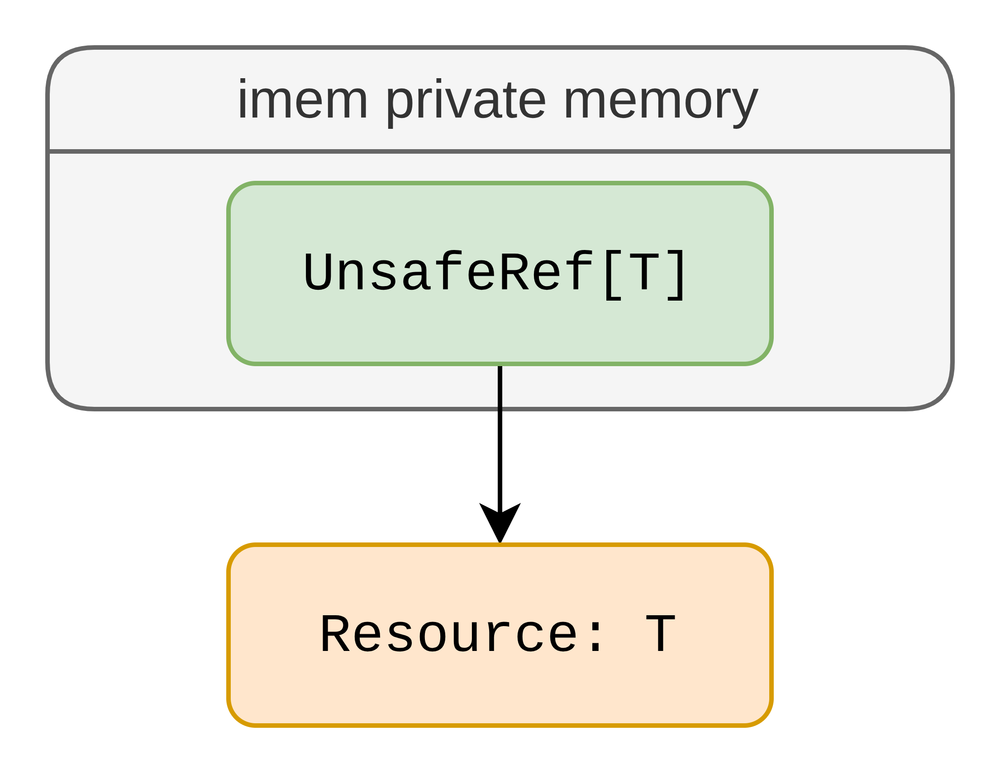
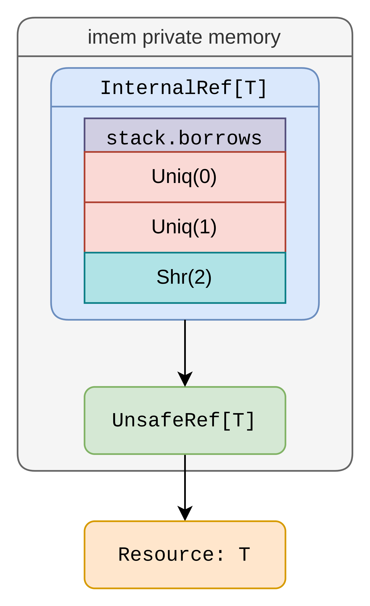
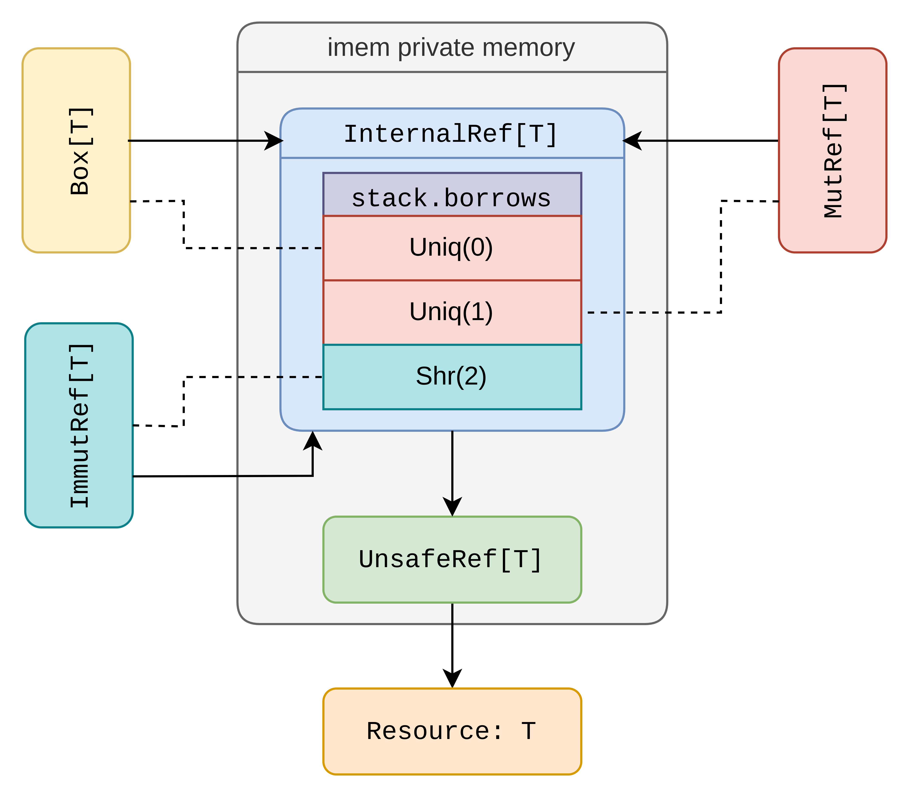
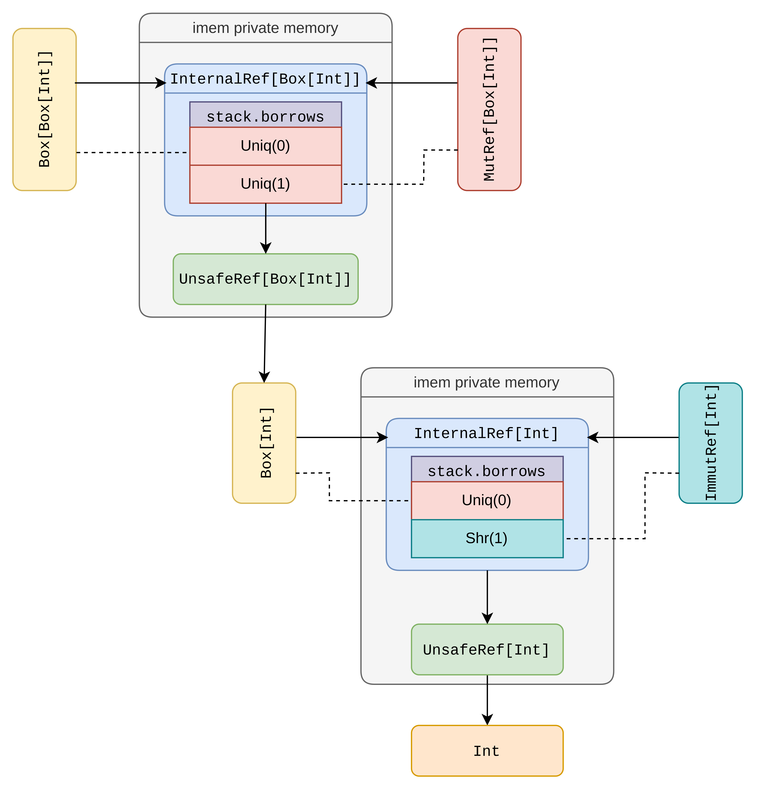
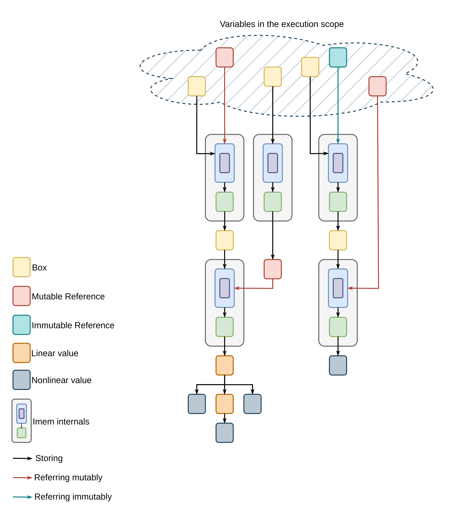
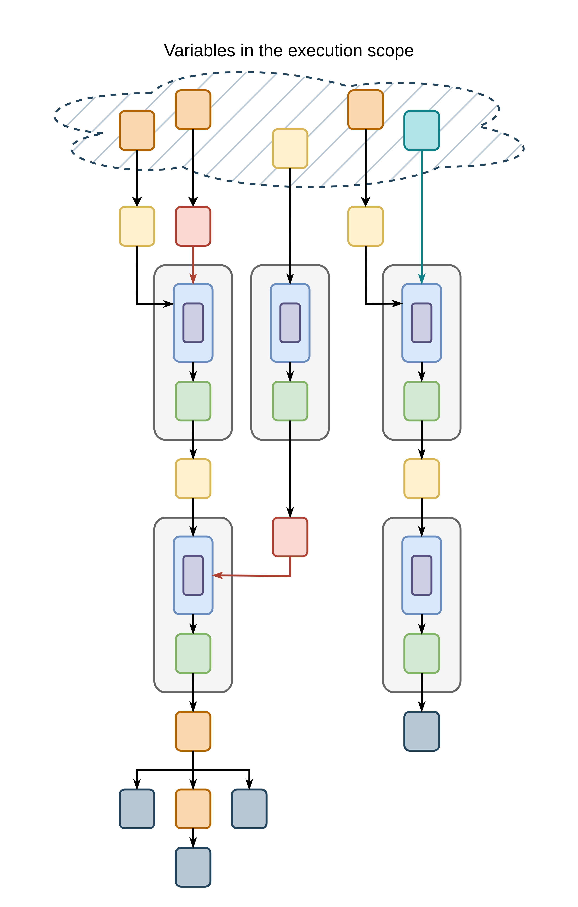

# Runtime

This section details the runtime verification mechanics of the imem library.
It explains how imem validates operations against the [Stacked Borrows Model](../background/stacked-borrows.md) rules and how the object graph evolves during runtime.
This section focuses solely on the dynamic behavior of the user-facing components.
The presented class definitions and interfaces include only their runtime functionality.
Static mechanisms, such as ownership and borrow checking, and their implementation details are reserved for subsequent sections.

## Internal components

### Resource

A resource is an instance of any type for which imem manages access.
The resource type may be a built-in type, a custom type, or a non-private imem type, such as `Box`, `ImmutRef`, or `MutRef`.

### Unsafe Reference

imem stores each resource in an unsafe reference.
These unsafe references are the only memory objects that directly refer to a resource.
In addition, the references are private, so the user never has direct access to them.
```Scala
private[imem] class UnsafeRef[T](private val resource: T):
  private[imem] def applyAction[S](action: T => S): S = action(resource)

  private[imem] def unsafeGet(): T = resource

  ... // rest of the implementation
end UnsafeRef
```
The `UnsafeRef` interface provides two methods for interacting with the stored resource.
The `applyAction` method follows a continuation-passing style, accepting an action and applying it to the resource.
The `unsafeGet` method returns the resource directly, and imem uses this method to move resources.

{: width="300"}

## Internal Reference

imem stores each unsafe reference inside an internal reference.
This internal reference records all accesses to the unsafe reference and ensures that these accesses follow the [Stacked Borrows Model](../background/stacked-borrows.md) rules.
Internal references are mutable and provide an interface for updating the underlying unsafe reference at runtime.
Similar to unsafe references, internal references are private and inaccessible outside the imem package.

```Scala
private[imem] class InternalRef[T](private var unsafeRef: UnsafeRef[T]):
  private type Timestamp = Long

  private[imem] enum Tag(val timestamp: Timestamp):
    case Uniq(override val timestamp: Timestamp) extends Tag(timestamp)
    case Shr(override val timestamp: Timestamp) extends Tag(timestamp)
  end Tag

  private class Stack:
    val borrows = scala.collection.mutable.Stack[InternalRef[T]#Tag]()
  end Stack

  private var currentTimeStamp = 0
  private val stack = Stack()

  /** Checks (NEW-MUTABLE-REF) rule
    */
  @throws(classOf[IllegalStateException])
  private[imem] def newUnique(derived: InternalRef[T]#Tag): InternalRef[T]#Tag = ...

  /** Checks (USE-1) rule
    */
  @throws(classOf[IllegalStateException])
  private[imem] def useCheck(tag: InternalRef[T]#Tag): Unit = ...

  /** Checks (NEW-SHARED-REF-1) rule
    */
  @throws(classOf[IllegalStateException])
  private[imem] def newShared(derived: InternalRef[T]#Tag): InternalRef[T]#Tag = ...

  /** Checks (READ-1) rule
    */
  @throws(classOf[IllegalStateException])
  private[imem] def readCheck(tag: InternalRef[T]#Tag): Unit = ...

  @throws(classOf[IllegalStateException])
  private[imem] def read[S](tag: InternalRef[T]#Tag, readAction: T => S): S = ...

  @throws(classOf[IllegalStateException])
  private[imem] def write[S](tag: InternalRef[T]#Tag, writeAction: T => S): S = ...

  private[imem] def unsafeGet(): T = unsafeRef.unsafeGet()

  private[imem] def setResource(resource: T): Unit =
    unsafeRef = UnsafeRef(resource)

  private[imem] def drop(): Unit = ...

  ... // rest of the implementations
end InternalRef
```

`InternalRef` tracks accesses by assigning a distinct tag to each access.
A tag is either unique (`Unq`), which permits both read and write access, or shared (`Shr`), which allows read-only access.
Also, every tag has a unique timestamp, where higher values indicate more recent tags.

Each internal reference maintains a stack of all live tags in `stack.borrows`.
The `newUnique` and `newShared` methods create new tags by deriving one from existing ones.
These methods check whether the tag holder has permission to request a new tag based on the `NEW-MUTABLE-REF` and `NEW-SHARED-REF-1` rules, respectively, given the current stack state.
If the check succeeds, the methods return the new tag; otherwise, they throw an `IllegalStateException`.

The `read` and `write` methods perform read and write actions on the resource.
Before applying an action, these methods call `readCheck` and `useCheck` to determine whether the `READ-1` and `USE-1` rules permit the requested actions.
If the tag does not have sufficient access permissions or is no longer live, the methods throw an `IllegalStateException`.

Note that rule checks, through `readCheck` and `useCheck`, are impure, meaning that they may change the borrower’s state.

The `setResource` method updates the underlying resource by creating a new unsafe reference that points to the resource.

The `drop` method clears the stack.
`imem` uses this method, along with `unsafeGet`, to move resources between internal references.

{: width="300"}

## User Facing Components

### Box

A box resembles conventional references, such as a C++ `unique` reference or a Rust `Box` reference.
`Box` is a linear class that the program can store its instances in other linear types, other boxes, pass them to functions, and borrow them to access their internal resources.  
However, unlike the Rust counterpart, a box in `imem` does not own its resource, as discussed in the [ownership section](./ownership.md).

Structurally, a box contains a tag and an internal reference.
The tag has a unique (`Unq`) type, and its timestamp is the smallest.
During borrowing, the box derives a new tag from its own tag.
This derivation produces either an immutable or a mutable reference, depending on the borrowing mode.

Similar to internal references, `Box` types are mutable and can modify their underlying resource through the associated internal reference.

```Scala
class Box[T, ...](
  private [imem] val tag: InternalRef[T]#Tag,
  private [imem] val internalRef: InternalRef[T]
) extends scinear.Linear

def borrowImmutBox[... T, ...](self: Box[T, ...]^)(...): (ImmutRef[T, ...], ...) = ...
def borrowMutBox[... T, ...](self: Box[T, ...]^)(...): (MutRef[T, ...], ...) = ...

def setBox[... T, ...](self: Box[T, ...]^, resource: T)(...): Box[T, ...]^{self} = ...
def swapBox[... T, ...](self: Box[T, ...]^, other: Box[T, ...]^)(...): (Box[T, ...]^{self}, Box[T, ...]^{other}) = ...

... // rest of the interface
```

Since `Box` is a linear type, its interface is defined by functions rather than methods.
The functions `borrowImmutBox` and `borrowMutBox` take a `Box` as input and return an immutable or mutable borrowed reference, respectively.

The `setBox` and `swapBox` provide mutability for a `Box`.
The `setBox` function updates the resource of a box with a new value, whereas `swapBox` exchanges the resources of two boxes.
These operations perform a `useCheck` on the box’s internal reference.

### Mutable and Immutable References

Mutable and immutable references are the only way that the program can access a box’s underlying resource.
An immutable reference provides read-only access, whereas a mutable reference allows both read and write access.
To obtain such a reference, the program should first borrow the box. 
Then, the program can access the resource through the reference’s interface.

Immutable references are not linear, so they can be replicated without any restriction.
In contrast, mutable references are linear.

Both reference types support reborrowing.
For an immutable reference, reborrowing is equivalent to replication.
However, the program can reborrow a mutable reference to derive either a new immutable reference or a new mutable reference.
When the program mentions the original mutable reference, the derived reference(s) become unavailable.
This behavior follows from the rules of the [Stacked Borrows Model](../background/stacked-borrows.md).

```Scala
class ImmutRef[T, ...](
  private[imem] val tag: InternalRef[T]#Tag,
  private[imem] val internalRef: InternalRef[T]
)

def borrowImmut[... T, ...](self: ImmutRef[T, ...]^)(...): ImmutRef[T, ...] = ...
def read[... T, ...](self: ImmutRef[T, ...]^, readAction: ... ?-> T^ -> S)(...): S = ...
... // rest of the interface

class MutRef[T, ...](
  private[imem] val tag: InternalRef[T]#Tag,
  private[imem] val internalRef: InternalRef[T]
) extends scinear.Linear

def borrowMut[... T, ...](self: MutRef[T, ...]^)(...): (MutRef[T, ...], ...) = ...
def borrowImmut[... T, ...](self: MutRef[T, ...]^)(...): (ImmutRef[T, ...], ...) = ...
def write[... T, ...](self: MutRef[T, ...]^, writeAction: ... ?-> T^ -> S)(...): S = ...
... // rest of the interface
```

Both reference types hold an internal reference and an access tag.

The `borrowImmut` and `borrowMut` functions enable reference reborrowing.
The [ownership section](./ownership.md) explains the mechanism that invalidates derived references once the primary mutable reference is used at compile time.
At runtime, accessing the primary mutable reference removes all derived reference tags from the internal reference's stack.

```Scala
// assume box: `Box[Int]` exists
val (mutRefPrimary, _) = imem.borrowMutBox[Int, ...](box)
val (mutRefDerived, _) = imem.borrowMut[Int, ...](mutRefPrimary)

imem.write[Int, ...](mutRefPrimary, _ => ())
imem.write[Int, ...](mutRefDerived, _ => ()) // error: `mutRefDerived`'s tag is popped
```

Furthermore, `ImmutRef` and `MutRef` provide `read` and `write` interfaces, respectively.
These functions follow a continuation-passing style, applying the given action to the resource if the [Stacked Borrows Model](../background/stacked-borrows.md) allows it.

All interfaces perform either a `readCheck` or a `useCheck` on the underlying internal reference, depending on the type of operation.

{: width="450"}

### Nested Boxes

Boxes are most useful when they are nested, meaning that a box’s resource is another box.
Using this structure, boxes can form common data structures such as linked lists and trees.
```Scala
// assume outerBox: `Box[Box[Int]]` exists
val (refOuter, _) = imem.borrowMutBox[Box[Int], ...](outerBox)

val refInner = imem.write[Box[Int], ...](refOuter,
  innerBox => 
    val (refInner, _) = imem.borrowImmutBox[Int, ...](innerBox)
    refInner
)
```
At runtime, the nested box in the example above structures the following object graph:
{: width="600"}

As the example demonstrates, to access the inner box, the program first borrows the outer box and then calls `read` or `write` function on the borrowed reference, `refOuter`.
The `read` or `write` function can return a borrowed reference to the inner box, `refInner`.
This process results in simultaneous references to both the inner and outer boxes.

The program can follow a similar process to have an immutable reference to the outer box and a mutable reference to the inner box:

```Scala
val (refMutOuter, boxHolder) = imem.borrowMutBox[Box[Int], ...](outerBox)
// The borrow checking section explains what a `boxHolder` is.
// For now, assume it stores the borrowed `Box`.

val refMutInner = imem.write[Box[Int], ...](refMutOuter,
  innerBox => 
    val (refMutInner, _) = imem.borrowMutBox[Int, ...](innerBox)
    refMutInner
)

// gets the `outerBox` out of the holder
val outerBox2 = imem.unlockHolder(..., boxHolder) // <-- static imem rules expires `refMutInner` here

val refImmutOuter = imem.borrowImmutBox[Box[Int], ...](outerBox2)
```

Similar to the [original Stacked Borrows paper](https://plv.mpi-sws.org/rustbelt/stacked-borrows/paper.pdf), imem’s runtime verification allows `refImmutOuter` and `refMutInner` to coexist.
The runtime permits this coexistence as long as `refImmutOuter` does not immutably borrow the inner Box.
```Scala
// `refMutInner` and `refImmutOuter` coexists here based on the runtime rules.
// imem.write[Int, ...](refMutInner, _ => ()) <-- ok with no runtime error

imem.read[Box[Int], ...](refImmutOuter,
  innerBox =>
    // asks for a new `Shr` tag deriving from the box's `Unq` tag.
    // pops `Unq` tag for `refMutInner`.
    imem.borrowImmutBox[Int, ...](innerBox)
)

imem.write[Int, ...](refMutInner, _ => ()) // runtime error
```

Similar to [Miri](https://github.com/rust-lang/miri) and Rust’s borrow checker, imem’s static rules are more restrictive than its runtime verification.
In the example above, the `refMutInner` would expire as soon as the `refMutOuter` is reborrowed immutably.
The borrow checking section explains why `refMutInner` and `refImmutOuter`, which are references to two nested boxes, cannot coexist in a program that successfully compiles using the imem library.

## Object Graph

Imem objects follow the same tree structure as linear objects.
The following is a demonstration of imem’s memory overview, if the program does not violate imem dynamic verification:

{: width="600"}

This illustration shows only reachable boxes and references whose tags remain in their corresponding internal borrow stacks.
In other words, the diagram represents the state of live references and boxes at a specific point during the program’s execution.
Boxes are linear, but they can have borrowed references from other boxes as their resources, so they form a Directed Acyclic Graph, DAG, structure.
At some nodes in the graph, the program borrows the box either mutably or immutably, yielding a mutable or an immutable reference, respectively.

If a program follows imem’s static rules, it cannot mutably borrow a box that lies within the reachable nodes of another box that is already immutably borrowed.
This restriction applies when one box can access another box by dereferencing the box to its resource.
The [borrow checking](./borrow-checking.md) and [ownership](./ownership.md) sections describe this rule and its implications in more detail.
When the program follows imem static rules, the resulting object graph has the structure as follows:

{: width="450"}

Another difference in the memory layout, when static rules are followed, is that some boxes and references are stored inside linear values rather than directly in variables within the execution scope.
These linear values are called `ValueHolder`s.
As the diagram illustrates, each connected component has exactly one box or reference directly available through a variable.
When the program unlocks a `ValueHolder`, imem invalidates the previous access point by making the old variable unavailable and then stores the new access point, which may be a box or a reference, in a fresh variable.
The borrow checking section explains this mechanism in more detail.
