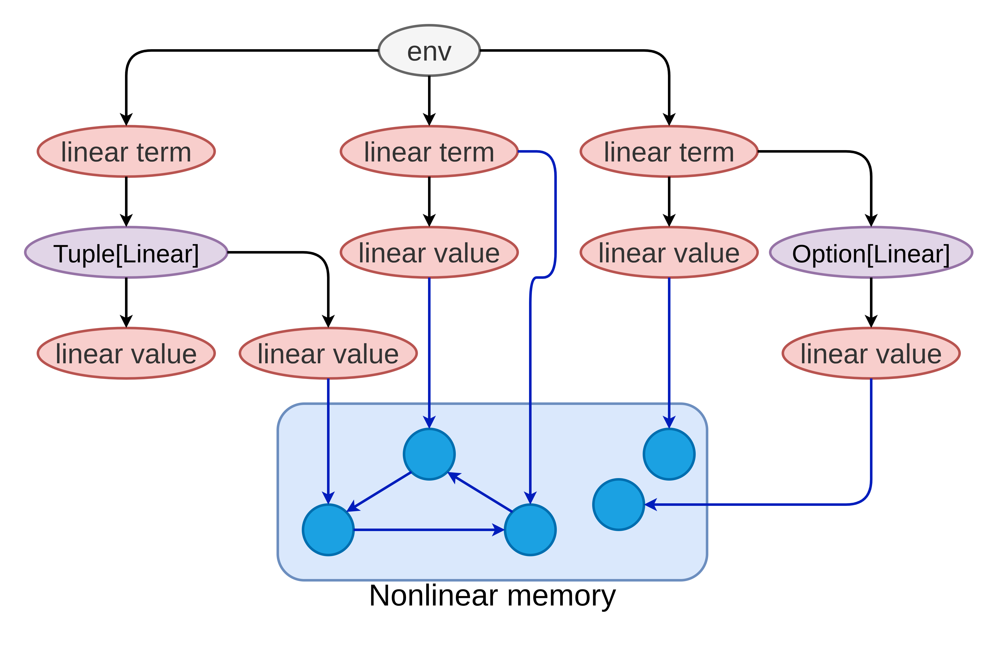

# Memory model

This section explains how Scinear rule enforcement shapes the graph of linear and nonlinear values at runtime.
Because `@HideLinearity` significantly affects the memory model, this discussion is structured into two parts.

For simplicity, this section only concerns programs that do not cast linear types to nonlinear types.

## With no `@HideLinearity`

### Memory Overview

In the absence of `@HideLinearity`, references to a linear type are not stored within a nonlinear type, other than `Option` and `Tuple`, due to the [nonlinear-type-field-rule](/docs/scinear/using-linear-types.md#fields-in-other-types).
Additionally, linear values are accessible only by other linear values or by linear references.

Reachable linear values form a tree rooted in the current execution scope.
The children of this root consist of the linear references available in the scope, while the remaining nodes represent linear values stored within other linear values.
Furthermore, linear values may refer to nonlinear values.
The following figure illustrates this memory overview:

<!-- TODO: change the diagram -->
{: width="700"}

### Why

Operations related to linear values fall into one of the following categories:

* Reading a field or calling a method: This interaction expires the linear references and designates the result of the method or field access as a new reference.  
* Creating a linear reference: This process results in a new linear reference.
Any linear reference used as an argument for the type constructor becomes a child of this new reference.

Based on the operations, the tree structure is consistently preserved.

## With `@HideLinearity`

The `@HideLinaerity` annotation allows bypassing all Scinear rules.
Specifically, wrapping the code that causes the error in a function annotated with `@HideLinaerity` that accepts a linear value as a polymorphic argument converts an error into a warning.
This mechanism is similar to Rust's `unsafe` keyword.  
As a result, the use of this annotation makes any object graph configuration possible.
Similar to Rust's unsafe, imem uses this feature to build basic memory management blocks.
While these blocks are internally unsafe, they expose a safe interface.
